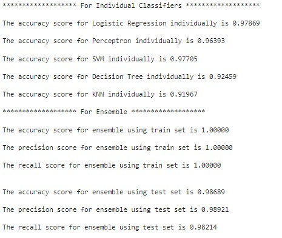

# SpamEmailClassifier

First, I used a Logistic Regression model to see how well it classifies the emails. It was pretty good, with a precision of around *98.1%*. Then, I tested out a Perceptron, an SVM, a Decision Tree, and a KNN model, all individually. I then made an ensemble of all these classifiers and used hard voting to get my final results, acheiving up to *98.7%* accuracy.

